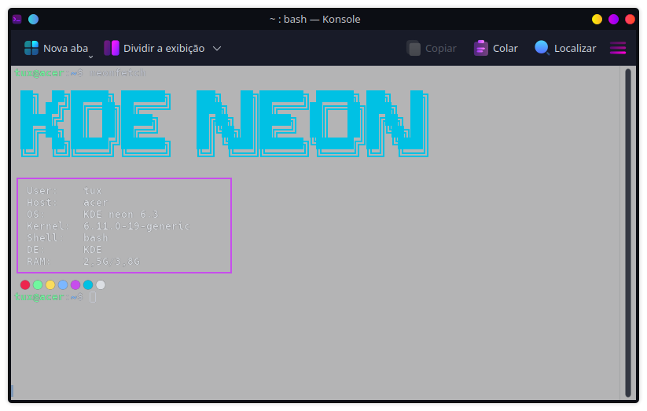

<h1>🚀💙 Neonfetch</h1>

<strong>Neonfetch</strong> é uma alternativa <strong>minimalista e eficiente</strong> ao antigo Neofetch. Ele exibe informações essenciais do sistema de forma <strong>clean</strong> e <strong>estilosa</strong>, seguindo um padrão de <strong>logo ciano</strong> e <strong>caixa de informações em magenta</strong>.

<h2>🎨 Características</h2>
<ul>
  <li>🖼 <strong>Design minimalista</strong>: Sem excesso de informações, só o essencial!</li>
  <li>⚡ <strong>Rápido e leve</strong>: Executa instantaneamente, sem consumo desnecessário.</li>
  <li>🎭 <strong>Estiloso</strong>: Exibe informações do sistema com um toque neon!</li>
  <li>💙 <strong>Alternativa moderna ao Neofetch</strong>: Simples, funcional e bonito.</li>
  <li>🚀 <strong>Expansível</strong>: Suporte para mais distros chegando nas próximas versões.</li>
</ul>

<h2>🔧 Instalação</h2>

Clone o repositório e torne o script executável:

<pre><code>git clone https://github.com/seu-usuario/neonfetch.git
cd neonfetch
chmod +x neonfetch.sh
</code></pre>

Agora é só rodar!

<pre><code>./neonfetch.sh
</code></pre>

<h2>🏗 Roadmap</h2>
<ul>
  <li>✔ <strong>Versão Alpha</strong> – Suporte inicial para algumas distribuições.</li>
  <li>🚀 <strong>Versão Beta</strong> – Suporte para <strong>Arch-based</strong> e <strong>Fedora-based</strong> (em breve).</li>
</ul>

<h2>📸 Preview</h2>

<h2>💡 Contribuição</h2>

Sinta-se à vontade para contribuir com melhorias ou novas funcionalidades!

