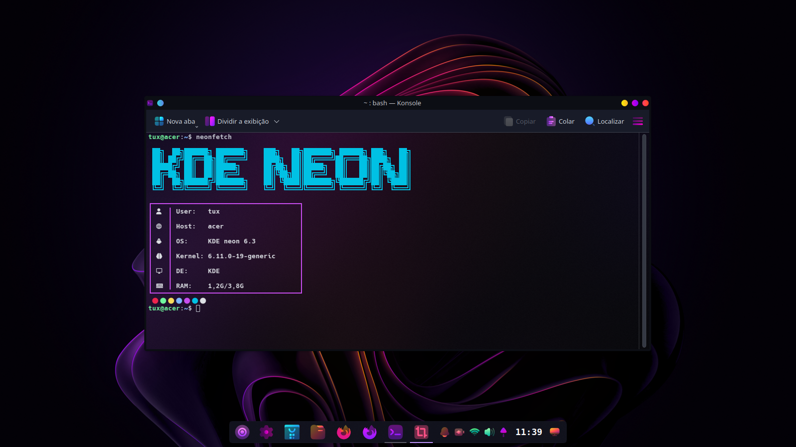

<pre>
███╗   ██╗███████╗ ██████╗ ███╗   ██╗███████╗███████╗████████╗ ██████╗██╗  ██╗
████╗  ██║██╔════╝██╔═══██╗████╗  ██║██╔════╝██╔════╝╚══██╔══╝██╔════╝██║  ██║
██╔██╗ ██║█████╗  ██║   ██║██╔██╗ ██║█████╗  █████╗     ██║   ██║     ███████║
██║╚██╗██║██╔══╝  ██║   ██║██║╚██╗██║██╔══╝  ██╔══╝     ██║   ██║     ██╔══██║
██║ ╚████║███████╗╚██████╔╝██║ ╚████║██║     ███████╗   ██║   ╚██████╗██║  ██║
╚═╝  ╚═══╝╚══════╝ ╚═════╝ ╚═╝  ╚═══╝╚═╝     ╚══════╝   ╚═╝    ╚═════╝╚═╝  ╚═╝
</pre>
**Neonfetch** é uma alternativa **minimalista e eficiente** ao antigo Neofetch. Ele exibe informações essenciais do sistema de forma **clean** e **estilosa**.

## 🎨 Características

- 🖼 **Design minimalista**: Sem excesso de informações, só o essencial!
- ⚡ **Rápido e leve**: Executa instantaneamente, sem consumo desnecessário.
- 🎭 **Estiloso**: Exibe informações do sistema com um toque neon!
- 💙 **Alternativa moderna ao Neofetch**: Simples, funcional e bonito.
- 🚀 **Expansível**: Suporte para mais distros chegando nas próximas versões.

## 🔧 Instalação

1. Faça o download do fetch correspondente.
2. Permita a execução como programa.
3. Rode o script no terminal.
4. Crie um alias no seu shell (opcional).

### **Requisitos**
- É necessário ter uma **Nerd Font** instalada para melhor experiência.

## 🏗 Roadmap

- ✔ **Versão Alpha** – Suporte inicial para algumas distribuições **Debian-based**.
- 🚀 **Versão Beta** – Suporte para **Arch-based** e **Fedora-based** (em breve).

## 📸 Preview

## 💡 Contribuição

Sinta-se à vontade para contribuir com melhorias ou novas funcionalidades!

