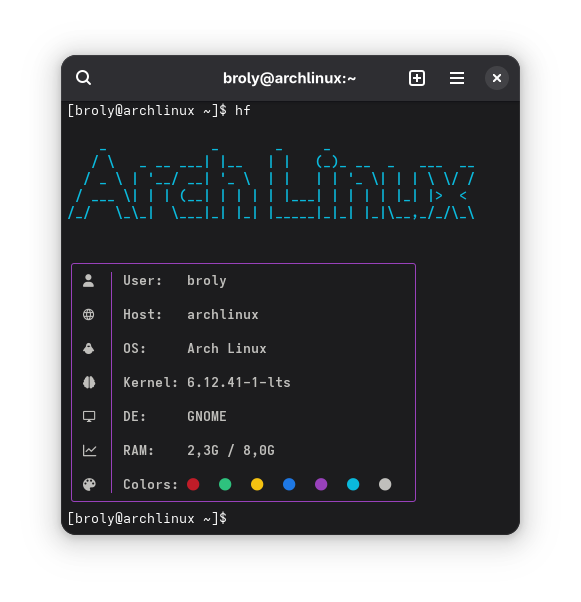

<h1 align="center">HydroFetch</h1>

<p align="center">
  <b>A modern, minimalist, and stylish system information tool.</b>
</p>

HydroFetch is a **fast and lightweight alternative to Neofetch**, focusing on simplicity, aesthetics, and essential system information. Its clean presentation and neon-inspired style make it the perfect choice for users who want their terminal to look great without unnecessary clutter.

## Features

- ✨ **Minimalist Design:** Shows only the most important system information in a clean layout.
- ⚡ **Fast and Lightweight:** Runs instantly with minimal system resource usage.
- 🎨 **Stylish Output:** Neon-inspired visuals and Nerd Font icons for a modern look.
- 🖥️ **Modern Alternative to Neofetch:** Simple, functional, and visually appealing.
- 🔌 **Extensible:** More Linux distributions and features coming soon!

## Installation

1. **Download** the appropriate `hydrofetch.sh` script from this repository.
2. **Make it executable:**
   ```bash
   chmod +x hydrofetch.sh
   ```
3. **Run the script:**
   ```bash
   ./hydrofetch.sh
   ```
4. *(Optional)* **Create an alias** in your shell configuration for easy access:
   ```bash
   echo "alias hydrofetch='~/path/to/hydrofetch.sh'" >> ~/.bashrc
   source ~/.bashrc
   ```

### Requirements

- **Nerd Font:** For the best visual experience, make sure you have a [Nerd Font](https://www.nerdfonts.com/) installed and set as your terminal font.
- **Figlet:** HydroFetch uses `figlet` for ASCII art. The script will attempt to install it automatically if not found.

## Usage

```bash
./hydrofetch.sh [option]
```

### Available Options

- `-h`, `--help`  
  Show the help message with usage instructions.
- `--all`  
  Display detailed and complete system information.
- `--tux`  
  Show a fun Tux (Linux mascot) easter egg.
- **Custom Font:**  
  For a personalized ASCII logo, place a `Custom.flf` font file in `~/.hydrofetch`.

## Preview




</img>
## Contribution

Contributions are welcome!  
Feel free to open issues or submit pull requests to add features, fix bugs, or improve documentation.
